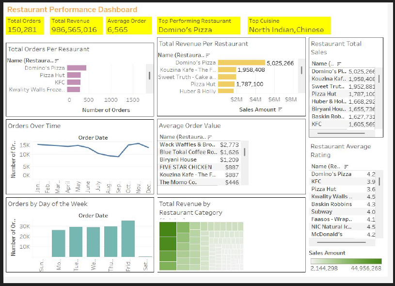
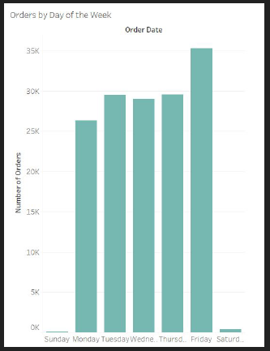
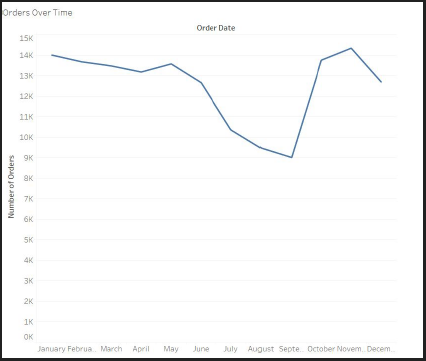
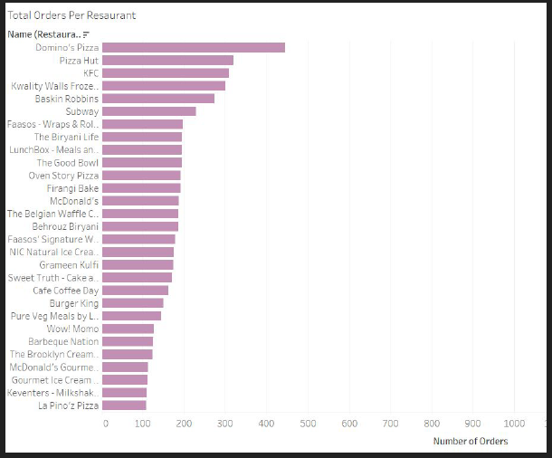
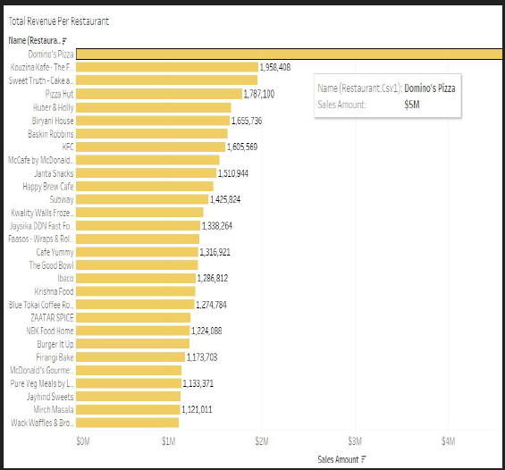
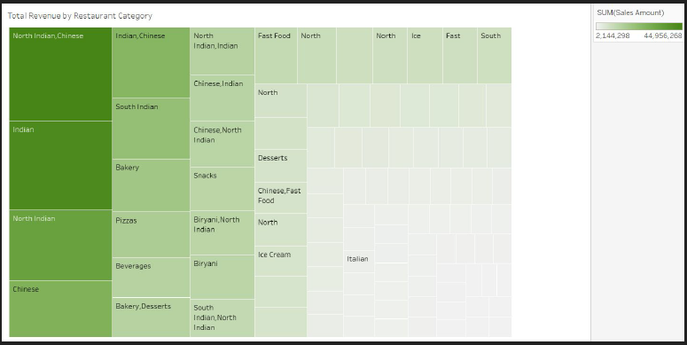

# 🍽️ Restaurant Performance Analysis

This project explores restaurant transaction data to uncover insights into **order patterns, revenue drivers, and cuisine preferences**.  
The goal is to help restaurants and food delivery platforms optimize operations, maximize revenue, and better understand customer demand.

📄 [Download Dataset (Excel)](https://practicum-content.s3.us-west-1.amazonaws.com/data-eng/remodeled/files/Superstore.xls?etag=4616d537c163874941cf5fc3c9002fa8)

---

## 📚 Skills & Techniques Applied

- **Data Visualization**: Designed interactive dashboards using Tableau
- **KPI Analysis**: Total orders, revenue, and average order value
- **Trend Analysis**: Orders by time, weekday, and category
- **Segmentation**: Performance comparison across restaurants and cuisines
- **Business Insights**: Strategic recommendations based on observed patterns

---

## 🔍 Objectives

- Identify **top-performing restaurants and cuisines**
- Explore **order trends by time and day of the week**
- Compare **revenue and popularity** across restaurants
- Discover **which categories drive the most revenue**
- Provide actionable recommendations for restaurant growth

---

## 📊 Visualizations & Insights

### Dashboard Overview  
  
**Insight:** Domino’s Pizza is the top performer in both **orders (1,500+)** and **revenue ($5M)**. North Indian and Chinese cuisines dominate sales, showing strong customer preference.

---

### Orders by Day of the Week  
  
**Insight:** **Friday and Sunday** see the highest order volumes, suggesting end-of-week peaks. Restaurants should focus promotions on these days.

---

### Orders Over Time  
  
**Insight:** Orders dipped mid-year but recovered strongly in Q4. Seasonality plays a role, with peaks around **October–December**.

---

### Popularity by Number of Orders  
  
**Insight:** Domino’s Pizza leads significantly in orders, followed by Pizza Hut and KFC. Quick-service chains dominate the top rankings.

---

### Total Revenue by Restaurant  
  
**Insight:** Domino’s Pizza tops revenue ($5M), followed by Kouzina Kafe ($2M). A long-tail effect is observed — a few restaurants generate the majority of revenue.

---

### Revenue by Restaurant Category  
  
**Insight:** **North Indian and Chinese cuisines** generate the highest revenue, indicating strong market demand. These categories are prime targets for expansion.

---

## ✅ Recommendations

1. **Capitalize on Top Performers**  
   - Expand partnerships with Domino’s, Pizza Hut, and KFC.  
   - Ensure peak inventory on **Fridays and Sundays**.  

2. **Target Cuisine Demand**  
   - Prioritize **North Indian and Chinese cuisines** for promotions and expansion.  
   - Explore bundling strategies to cross-sell popular categories.  

3. **Seasonal Campaigns**  
   - Focus marketing around **Q4 (Oct–Dec)** when orders spike.  
   - Introduce limited-time offers to capture seasonal demand.  

4. **Support Mid-Tier Restaurants**  
   - Provide visibility boosts to restaurants in the $1M–$2M revenue range.  
   - Encourage promotional deals to grow market share.  

---

## 🛠 Tools Used

- **Tableau Public** – Visual analytics & storytelling  
- **Excel** – Data preprocessing & cleaning  
- **GitHub** – Version control & documentation  

---

🚀 Final project submission for the *Data Visualization with Tableau* sprint in TripleTen's Business Intelligence Analyst program.
