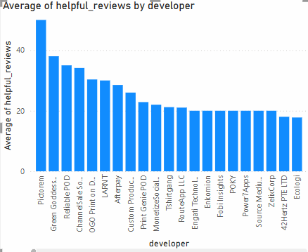
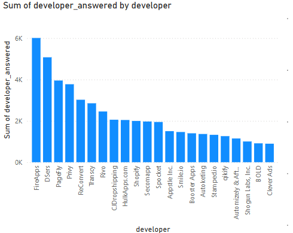
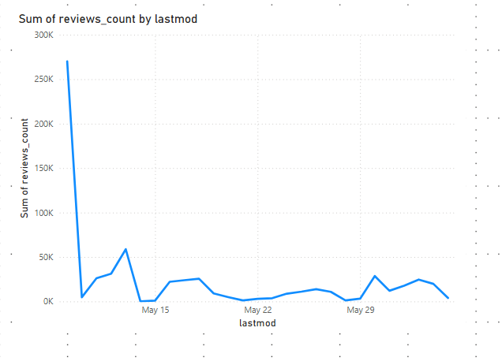
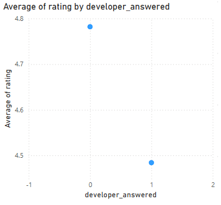
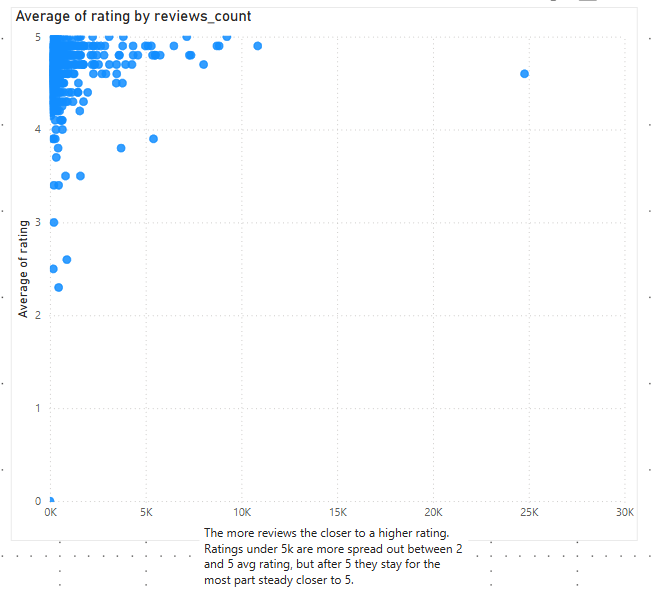
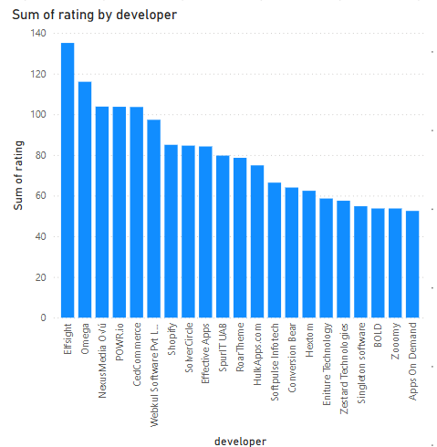

# Appstore-Intelligence Shopify 📊

This Power BI project explores what factors contribute to the success of apps on the Shopify platform by analyzing app metadata, user reviews, and developer interactions.

## 📁 Dataset Overview

The dataset contains four related tables:
- **apps**: Metadata including app name, developer, rating, and review count
- **apps_categories**: Mapping between apps and categories
- **categories**: App category labels
- **reviews**: Ratings, review text, and developer responses

---

## 📊 Key Visualizations

| Visual | Description |
|--------|-------------|
|  | **Average Helpful Reviews by Developer** – Shows which developers receive the most positively rated and helpful user feedback. |
|  | **Sum of Developer Replies by Developer** – Highlights the most active developers in terms of responding to user reviews. |
|  | **Review Volume Over Time** – Tracks changes in total review count by last modification date, suggesting trends in app updates or usage. |
|  | **Average Rating by Whether Developer Replied** – Indicates that apps with no developer reply tend to have higher average ratings, suggesting developers often respond to negative reviews. |
|  | **Average Rating by Review Count** – Shows that apps with more than 5,000 reviews stabilize closer to 5 stars, indicating sustained user satisfaction. |
|  | **Total Ratings by Developer** – Identifies the developers with the most total ratings, suggesting the most exposure or reach. |

---

## 🧠 Key Insights

- High-review-count apps tend to stabilize around high ratings, proving consistent performance.
- Developers who receive the most helpful reviews (e.g., *Pictorem*, *Green Goddess*) stand out for both support and app quality.
- The most responsive developers (e.g., *FireApps*, *DSers*) may be actively managing reputation, especially for critical feedback.
- High visibility (e.g., total ratings) doesn’t always align with helpfulness or support quality.

---

## 🛠 Tools Used

- Power BI Desktop
- DAX (for `helpful_reviews`, `developer_answered`)
- Relational data modeling
- Visual analytics

---

## 📂 Screenshot Directory

Ensure all image files are placed in a folder called `/images` inside the GitHub repository.

---

## ✍️ Author

**Antonio Palomar**  
Junior Business Intelligence Analyst  
GitHub: [YourGitHubUsername]  
Portfolio: [Link if available]
