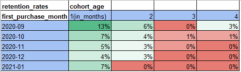
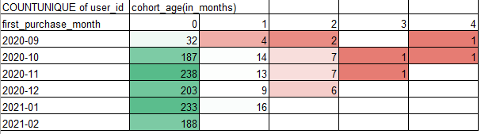

# E-Commerce Funnel & Retention Analysis

## Overview

This project analyzes user behavior from an e-commerce company's website by turning raw event logs into actionable business metrics. The goals were to:

- Construct a **conversion funnel** showing user progression from product view to purchase
- Conduct a **cohort analysis** to evaluate monthly retention patterns post-purchase

## Dataset

The data came from raw user activity logs (`raw_user_activity` tab) and includes:

- `user_id`: Unique user identifier
- `event_type`: Type of activity (view, cart, purchase)
- `category_code`, `brand`: Product and brand data
- `price`: Product price in USD
- `event_date`: Date of activity

## Key Analyses

### 🔁 Conversion Funnel

The `conversion_funnel` sheet shows how users moved from viewing products to making purchases.

- **Views → Cart** conversion: ~29%
- **Cart → Purchase** conversion: ~35.6%
- **Total funnel conversion** (View → Purchase): ~10.3%

Conversion rates were calculated using unique user counts per funnel stage.

### 📅 Cohort Analysis & Retention

Users were grouped into monthly **acquisition cohorts** based on their first purchase. The retention rates in the `retention_rates` sheet reflect how many users returned in subsequent months:

- Average 1-month retention across cohorts: ~5–12%
- Very low retention after 3 months across all cohorts

Cohort ages and purchase tracking were based on the difference between each user's event date and their first purchase date.

## File Structure

- **conversion_funnel** – Pivot table of user conversion stages
- **purchase_activity** – Filtered data with purchase events
- **first_purchase** – Each user's first purchase date
- **cohort_analysis** – Pivot table grouping users by cohort month and cohort age
- **retention_rates** – Retention rate calculation based on cohort analysis
- **Executive Summary** – Project summary with assumptions and findings
- **Table of Contents** – Overview of spreadsheet tabs
- **raw_user_activity** – Original dataset

## Tools Used

- Google Sheets / Excel
- Pivot tables
- Formulas: `COUNTUNIQUE`, `VLOOKUP`, `TEXT`, `DATEDIF`

## Assumptions

- Each review corresponds to a single completed purchase
- Users are uniquely identified across sessions
- Price field reflects actual paid amount
- All events are tracked accurately and comprehensively

## Author

Antonio Palomar  
Project completed as part of the TripleTen Data Analytics Bootcamp  
Folder: **ecommerce_funnel_retention_analysis**
