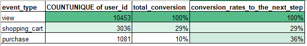

# 📦 E-Commerce Funnel & Retention Analysis

## 📌 Project Overview

This project analyzes user behavior from an e-commerce company's website by turning raw event logs into actionable business metrics. The goals were to:

- Construct a **conversion funnel** showing user progression from product view to purchase
- Conduct a **cohort analysis** to evaluate monthly retention patterns post-purchase

---

## 🗂️ Dataset

The data comes from raw user activity logs (`raw_user_activity` tab) and includes:

- `user_id`: Unique user identifier
- `event_type`: Type of activity (view, cart, purchase)
- `category_code`: Product category
- `brand`: Product brand
- `event_time`: Timestamp of the event

---

## 🔍 Key Questions Answered

1. What does the conversion funnel look like across product view, cart, and purchase stages?
2. How well does the company retain users over time after their first purchase?

---

## 🧼 Data Cleaning & Preparation

Performed in Excel:
- Converted `event_time` to a readable datetime format
- Categorized events into funnel stages
- Assigned `cohort_month` and `event_month` for retention tracking
- Created pivot tables to analyze retention by cohort

---

## 📈 Visualizations

### 1. Conversion Funnel  
  
**Insight:**  
Significant drop-off occurs between cart and purchase, suggesting checkout process optimization is needed.

---

### 2. Monthly Retention by Cohort  
  
**Insight:**  
Retention drops sharply after the first month, with only a small fraction of users returning in month 2 or beyond.

---

## 🧠 Assumptions

- Each `user_id` represents a unique customer  
- Users begin their journey with a `view` event and progress through `cart` to `purchase`  
- A user's cohort is based on the month of their **first purchase**

---

## 🛠️ Tools Used

- Excel (Data Cleaning & Pivot Tables)  
- Tableau Public (Data Visualization)  
- GitHub (Project Versioning & Documentation)

---

🚀 Project submission for the Spreadsheet Data Analysis sprint (TripleTen BI Program).
