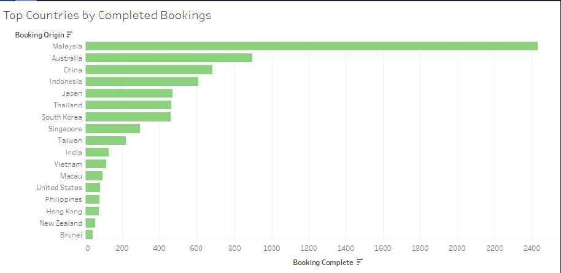
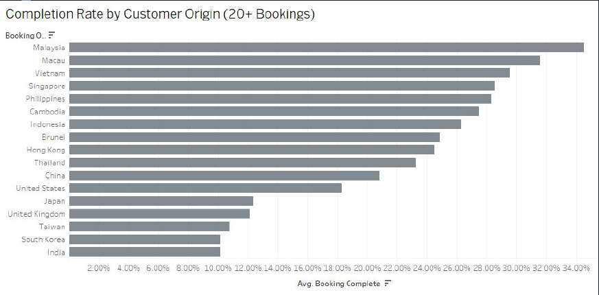
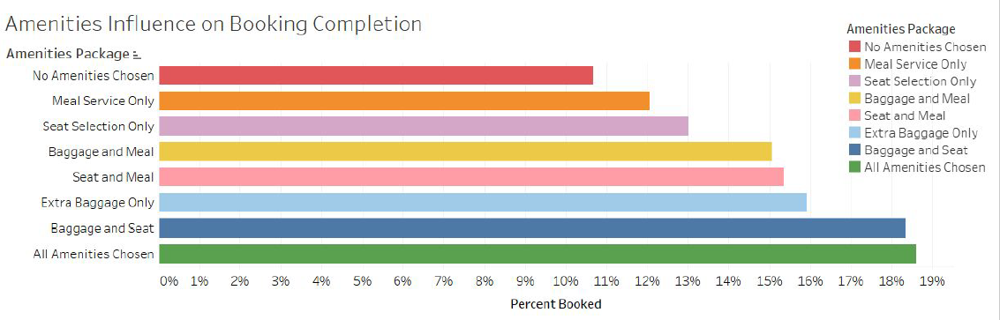
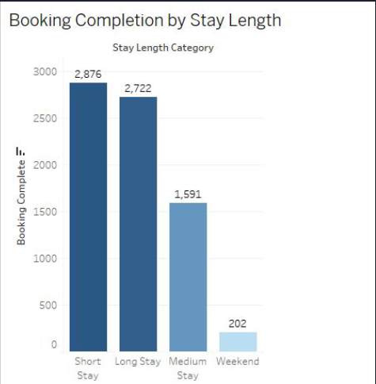
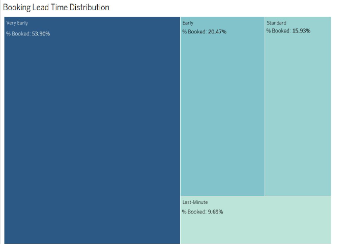
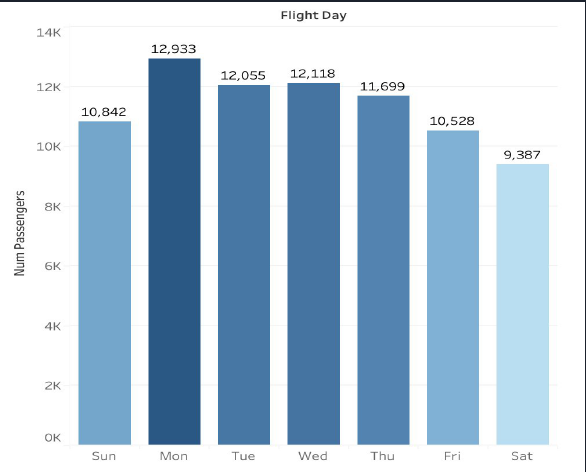

# ✈️ Flight Booking Behavior & Completion Insights

This project analyzes customer booking behavior to uncover factors that influence **flight booking completion rates** and provide actionable business insights. The dataset contains ~49,000 records of flight bookings, with features such as booking lead time, stay length, optional services, and completion status.

---

## 🏆 Recognition

This project was developed as part of the **June 2025 BIA Code Pudding** and won **First Place** 🥇 with the **Sky Metrics** team.  
- ✅ Awarded *highest score from the judges* for data storytelling and insights  
- 🎥 [Watch our presentation (YouTube, starts at 28:25)](https://www.youtube.com/live/bfuyu3FLFFI?t=1705)  

---

## 🎯 Objective
To identify key drivers of flight booking completion and understand traveler decision-making patterns that impact conversions.

---

## 📂 Dataset
- **Source:** `customer_booking_cleaned.csv`
- **Size:** ~49,000 records
- **Features:**
  - Booking lead time
  - Customer origin
  - Trip/stay length
  - Optional services (meals, baggage, seat selection)
  - Booking completion status

---

## 🛠 Tools Used
- **Excel** – Data cleaning, feature creation, categorization  
- **Tableau** – Visualizations, storytelling dashboards  

---

## 🔧 Data Preparation
- Removed duplicates for clean entries  
- Created new categorical fields:  
  - `lead_time_category` → Last-Minute, Standard, Early, Very Early  
  - `stay_length_category` → Weekend, Short, Medium, Long  
  - `booking_status` → Yes/No  
  - Amenities fields → “Wants Extra Baggage”, “Wants Meal”, “Choose Seat”  
  - `day_type` → Weekday vs. Weekend  
- Built calculated fields:  
  - `%booked` = Completed bookings ÷ Total bookings  
  - Amenity combinations (for segmentation)  

---

## 📊 Visualizations & Insights

### 🌍 Top Countries by Completed Bookings
  
**Insight:** Malaysia is the clear leader in completed bookings (2,400+), followed by Australia and China. While volume is high across Asia-Pacific, not all countries show equally strong conversion.

---

### 🌍 Completion Rate by Country (20+ Bookings)
  
**Insight:** Malaysia combines both **high booking volume** and **high completion rate (~34%)**, making it a standout market. Other strong performers in conversion include Macau, Vietnam, and Singapore. This suggests these regions should be prioritized for marketing.

---

### 🧳 Amenities Influence on Booking Completion
  
**Insight:** The more amenities travelers choose, the higher their likelihood of completing a booking. Customers selecting **all three (baggage, meal, seat)** had the highest completion (~19%), compared to just ~11% for those who chose none. Feature selection is a strong indicator of intent.

---

### 🏨 Booking Completion by Stay Length
  
**Insight:** **Short stays** (2,876) and **long stays** (2,722) show the strongest commitment, while **medium stays** have higher cancellations. Weekend trips are least reliable, suggesting more price sensitivity or uncertainty in short leisure travel.

---

### ⏳ Booking Lead Time Distribution
  
**Insight:** Travelers who book **very early (46+ days in advance)** represent ~54% of completions, confirming early planning leads to stronger commitment. Last-minute bookings (<7 days) have the lowest completion (~10%), likely due to cancellations or travel uncertainty.

---

### 📅 Popular Booking Days
  
**Insight:** **Mondays** are the most popular day to book flights (~12,900 bookings), followed by Tuesday and Wednesday. Saturdays lag behind, making weekdays the prime target for promotional campaigns.

---

## 🧠 Business Implications
1. **Encourage early bookings** through incentives or discounts.  
2. **Target customers who select extras** — they show high intent.  
3. **Prioritize high-value regions** (e.g., Malaysia, Macau, Vietnam).  
4. **Focus marketing on medium-trip travelers** to reduce drop-off.  
5. **Leverage booking-day insights** (e.g., Monday promos).  

---

## ⚠️ Limitations
- No revenue data included.  
- No customer demographics (age, income, loyalty status).  
- Binary completion status oversimplifies customer journey.  
- Assumes all optional features are equal in cost/weight.  

---

## 🛠 Tools Used
- **Tableau Public** – Visual analytics & storytelling  
- **Excel** – Data preprocessing & feature engineering  
- **GitHub** – Version control & documentation  

---

🚀 Final project submission for the **June 2025 BIA Code Pudding competition**, where it won **First Place** 🥇 with the *Sky Metrics* team.  
