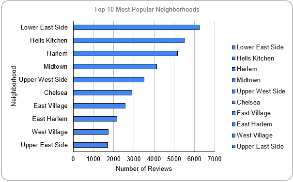
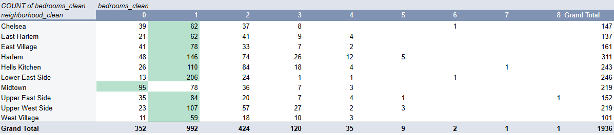

# 🏙️ Manhattan Vacation Rental Market Analysis

## 📌 Project Overview

This project analyzes Airbnb listings in Manhattan to help a client determine the most attractive neighborhoods and property sizes for investment in the vacation rental market. The analysis is based on Airbnb open data and includes insights into rental popularity and revenue potential.

**Sprint 1 — Spreadsheet Data Analysis**  
Conducted as part of TripleTen’s Data Analytics program.

📄 [View Full Project Spreadsheet](https://docs.google.com/spreadsheets/d/1GqIG4HPlfzu_2T8SJvossuLtErgViuUOdrMulZeVoYI/edit?gid=442099053#gid=442099053)

---

## 🗂️ Dataset

The dataset includes property listings and calendar availability scraped from Airbnb public data.

📊 [Access the Raw Dataset](https://docs.google.com/spreadsheets/d/1qdnGCyf_eMhtXXvbPIc8wnz3WIlllL2GnlYvVBlufx8/copy)

Key fields include:
- `neighborhood`, `room_type`, `bedrooms`, `price`, and `review_count`  
- Calendar data with nightly pricing and availability  
- Cleaned using `PROPER()`, `TRIM()`, and conditional logic

---

## 🔍 Key Questions Answered

1. Which neighborhoods and property sizes are most attractive for vacation rentals?  
2. How much revenue did these listings generate?

---

## 🧼 Data Cleaning Steps

Performed in Excel:
- Standardized `neighborhood` names using `TRIM()` and `PROPER()` → stored in `neighborhood_clean`  
- Cleaned `bedrooms` column using `IF(ISBLANK(...), 0, ...)` → stored in `bedrooms_clean`  
- Created a `top_listing` column where:
  - `top_neighborhood` is `TRUE`
  - `top_bedroom` is `TRUE`  
- Revenue calculation:
  - `IF(available = "f", adjusted_price, 0)` → `revenue_earned`
  - `SUMIF()` matched revenue by `listing_id`
  - Estimated annual revenue = 30-day revenue × 12

---

## 📊 Analysis Highlights

- **Top Neighborhoods** by review count (used as a proxy for rental activity)  
- **Most Common Property Sizes:** 1-bedroom units dominate, with studios more popular in Midtown  
- **Top Listings** chosen from the most active neighborhoods with highest-earning unit types

| Listing | Estimated Annual Revenue |
|---------|---------------------------|
| ID 1    | $359,280                  |
| ID 2    | $313,200                  |
| ...     | ...                       |

---

## 📈 Visualizations

### 1. Top 10 Most Popular Neighborhoods by Number of Reviews  
  
**Insight:**  
Lower East Side, Hells Kitchen, and Harlem are the most reviewed neighborhoods, suggesting high rental traffic.

---

### 2. Property Sizes by Neighborhood (Pivot Table)  
  
**Insight:**  
1-bedroom listings are most common in most areas, but Midtown favors studios — likely due to apartment layouts and short-stay guests.

---

## 📁 File Structure

The project spreadsheet includes the following sheets:

- **Processed Listings**  
  Cleaned and enhanced Airbnb listing data with:
  - `listing_id`, `neighborhood_clean`, `bedrooms_clean`, `price`, `review_count`
  - Calculated columns: `top_listing`, estimated 30-day and annual revenue

- **Calendar**  
  Night-by-night availability and pricing:
  - `listing_id`, `date`, `available`, `adjusted_price`
  - Used to compute realized revenue and identify inactive days

- **Top Listings**  
  Filtered view of listings:
  - Located in top 10 neighborhoods  
  - Featuring the most common bedroom type per neighborhood  
  - Includes revenue estimates and sorting criteria

- **Pivot Tables**  
  Summary pivot tables used to generate:
  - Top 10 neighborhoods by review count  
  - Most common property sizes by neighborhood  
  - Revenue rankings for selected `top_listing` records

---

## 🛠️ Tools Used

- Excel (Data Cleaning, Calculations & Pivot Tables)  
- GitHub (Project Versioning & Documentation)

---

## 📚 Skills & Techniques Applied

This project applied key analytical techniques from the Profitability & Funnel Analysis sprint to understand rental performance across Manhattan:

### 💰 Financial Modeling & Demand Analysis
- Built spreadsheet models to calculate **revenue earned** and **annual revenue estimates** for listings
- Used conditional logic (`IF`, `ISBLANK`, `SUMIF`) to calculate profits and clean inputs
- Identified **high-demand bedroom types** per neighborhood based on review count and listing frequency

### 🧭 Funnel Thinking & Spreadsheet Structuring
- Created **segmentation logic** for identifying top-performing listings using flags like `top_neighborhood` and `top_bedroom`
- Applied funnel thinking by ranking listings through multiple layered criteria (location, room type, revenue)

### 📊 Spreadsheet Communication
- Structured data into **clean, stakeholder-ready tables** using pivot tables and summary views
- Used formatting, filters, and labels to support intuitive storytelling with the data

---

🚀 Project submission for the Spreadsheet Data Analysis sprint (TripleTen BI Program).
