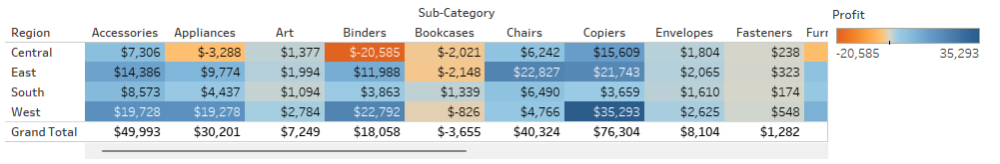
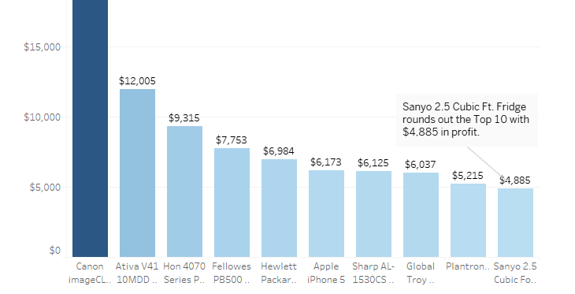
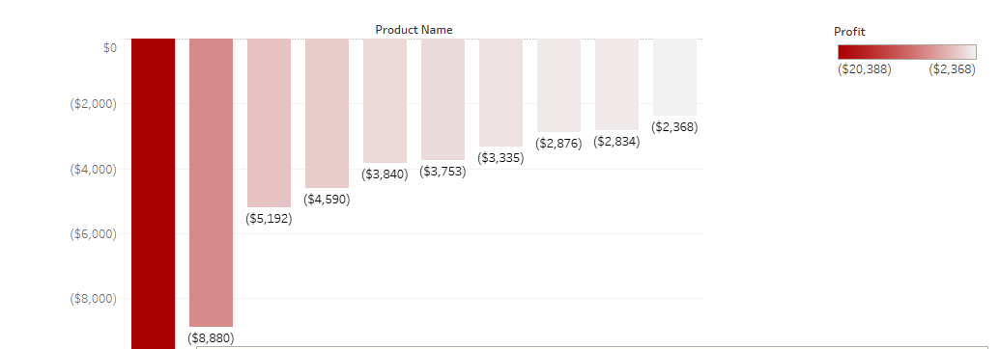
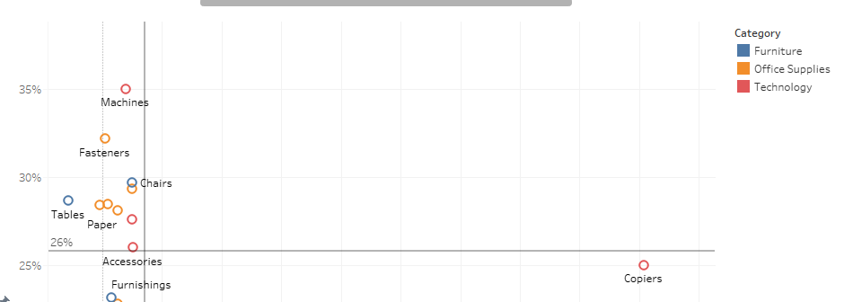
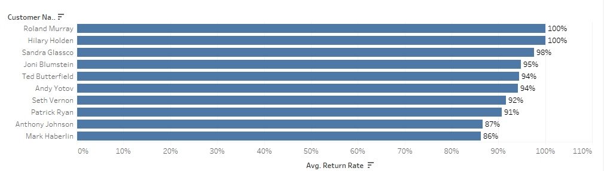
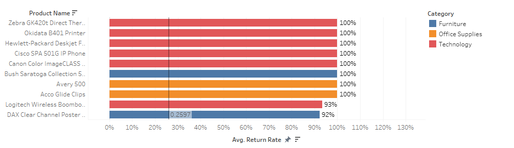
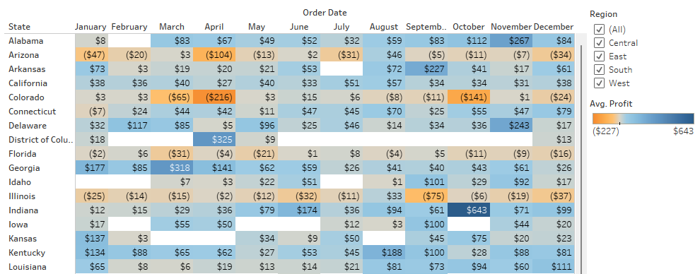

# 📊 Superstore Profitability Analysis

This project analyzes transaction data from a fictional superstore to uncover key business metrics around profitability, customer behavior, and regional trends.

By exploring category-level and regional performance, the goal is to inform data-driven recommendations that help improve operational strategy, optimize product offerings, and focus on geographic areas with high potential for profitability.

---

## 🔗 Project Links
- [📊 View Full Tableau Story](https://public.tableau.com/views/superstore-profitability-analysis/SuperstoreProfitabilityAnalysis?:language=en-US&publish=yes&:sid=&:redirect=auth&:display_count=n&:origin=viz_share_link)
- [📄 Download Dataset (Excel)](https://practicum-content.s3.us-west-1.amazonaws.com/data-eng/remodeled/dvwt/Superstore.xls?etag=4616d537c163874941cf5fc3c9002fa8)

---

## 📚 Skills & Techniques Applied
This project was completed as part of the **Data Visualization with Tableau** sprint in TripleTen's Business Intelligence Analyst program.

### 📈 Visual Analytics
- Built bar charts and scatter plots to highlight profitability trends across products and regions  
- Designed highlight tables to visualize state-level differences in revenue and seasonal performance  
- Used return-rate vs profit plots to identify high-risk, low-margin products  

### 🎯 Dashboard Design Principles
- Emphasized clean visual communication with consistent formatting and color use  
- Structured charts around actionable insights (e.g., products to stop selling, top-performing regions)  
- Focused each visual on a specific business question to maintain clarity and narrative focus  

### 🔧 Data Structuring in Tableau
- Used calculated fields and filters to derive metrics like return rate and profit average  
- Aggregated sub-categories and states for summary-level insights  
- Applied filters and visual grouping directly in Tableau (no external preprocessing)  

---

## 🔍 Objective
To translate raw transaction data into actionable business insights by identifying:

- High-performing products and sub-categories  
- Product lines and regions with consistent losses  
- Customer return trends and their effect on profits  
- Seasonal and regional profit trends across the United States  

---

## 📊 Key Visualizations & Insights

### Profits & Losses by Region and Sub-Category

### Top Selling Products by Profit

### Bottom Products by Profit

### Average Profit vs. Average Return Rate

### Returns by Customer

### Returns by Product

### State-Level Seasonality in Profits

---

## 🧠 Conclusion
This analysis reveals clear action items for improving profitability across the business:

1. **Double down on high-value products & regions** (e.g., Copiers, Canon ImageCLASS, strong states like Indiana, Vermont, and Washington).  
2. **Cut or renegotiate loss-making categories** (e.g., Tables, Bookcases, GBC DocuBind).  
3. **Manage returns more effectively** by investigating chronic returners and high-return products.  
4. **Leverage seasonality** by aligning marketing and stock with peak months (e.g., September, December).  

By acting on these insights, the superstore can reduce waste, increase margins, and better meet customer needs.  

---

## 🛠 Tools Used
- Tableau Public (Data Visualization)  
- GitHub (Project Versioning & Portfolio)  

🚀 Final project submission for the **Data Visualization with Tableau sprint** at TripleTen.
