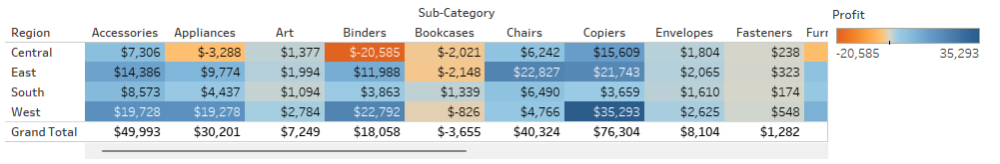
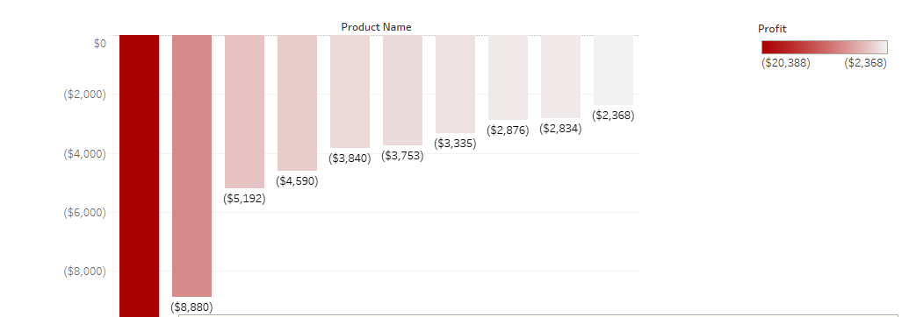
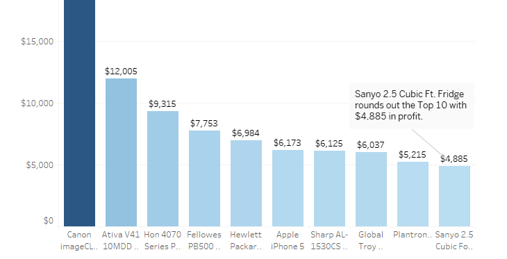
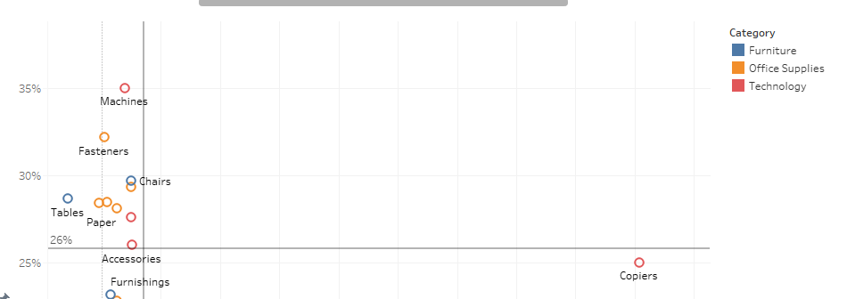
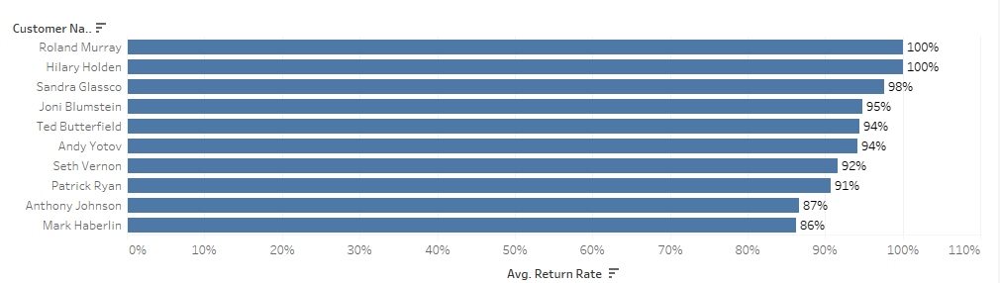
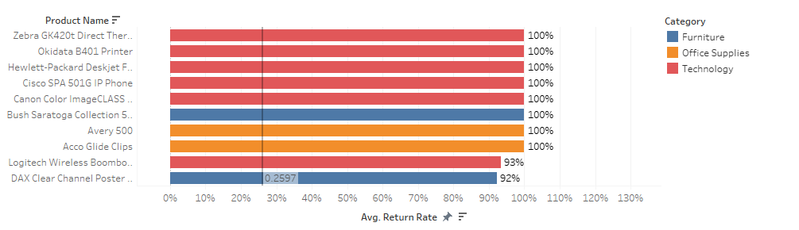
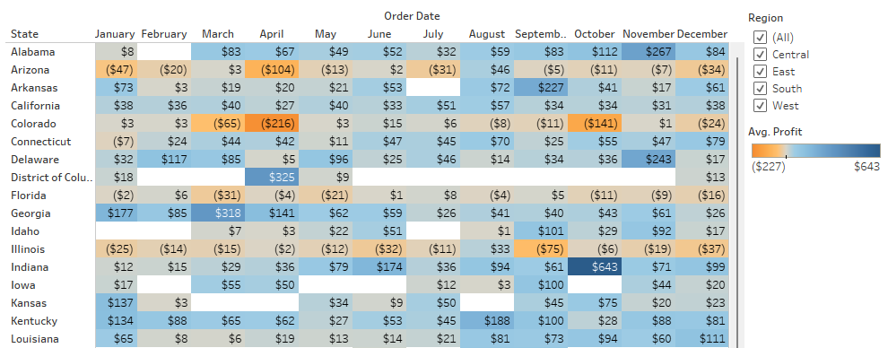

# 📊 Superstore Profitability Analysis

This project analyzes transaction data from a fictional superstore to uncover key business metrics around profitability, customer behavior, and regional/seasonal trends. The analysis surfaces high-value products and markets, highlights loss-making items, and pinpoints return-rate risks—turning the raw data into clear, actionable recommendations.

---

## 🔗 Project Links

- **Live Tableau Story:**  
  https://public.tableau.com/views/superstore-profitability-analysis/SuperstoreProfitabilityAnalysis?:language=en-US&publish=yes&:sid=&:redirect=auth&:display_count=n&:origin=viz_share_link

- **Dataset (Excel, Tableau Sample Superstore):**  
  https://practicum-content.s3.us-west-1.amazonaws.com/data-eng/remodeled/dvwt/Superstore.xls?etag=4616d537c163874941cf5fc3c9002fa8

---

## 📚 Skills & Techniques

**Visual Analytics**
- Built bar charts, highlight tables, and scatter plots to reveal profitability patterns across products, states, and time.
- Crafted return-rate views for both products and customers to flag quality and policy issues.

**Dashboard/Story Design**
- Clean layout, consistent color semantics, and annotation for quick insight uptake.
- Each visual answers a focused business question; the story flows from “what” → “so what” → “now what.”

**Data in Tableau**
- Calculated fields (e.g., Avg Profit, Return Rate).
- Aggregations at sub-category and state levels.
- Filters, parameters, and story points for guided exploration.

---

## 🎯 Objective

Convert transactional data into decisions by identifying:
- High-performing products/sub-categories
- Chronic loss areas (items/regions)
- Return behavior (customers & products)
- State and seasonal profit opportunities

---

## 📊 Key Visualizations & Insights

### 1) Profits & Losses by Region and Sub-Category

**Insight:** Copiers and Chairs are reliable profit drivers (esp. West/East). Binders and Tables frequently lose money—candidates for vendor renegotiation, pricing review, or discontinuation.

---

### 2) Bottom (Most Unprofitable) Products

**Insight:** A few SKUs (e.g., GBC DocuBind system, CubeX 3D printer) account for outsized losses. These should be addressed first to stop profit leakage.

---

### 3) Top Products by Profit

**Insight:** Profit is concentrated—Canon ImageCLASS alone delivers ~$38K. Prioritize availability, promos, and cross-sell around these top earners (classic 80/20).

---

### 4) Avg Profit vs Return Rate (by Sub-Category)

**Insight:** High return + low profit quadrants flag risk items (e.g., Machines/Fasteners). Copiers remain attractive: **high profit despite moderate returns**.

---

### 5) Highest Return-Rate Customers

**Insight:** A small cohort returns **90–100%** of purchases. Tighten policies, require RMA approvals, and review incentives for these accounts.

---

### 6) Highest Return-Rate Products

**Insight:** Several printers/phones hit **~100%** return rates → likely quality/vendor or expectation mismatch issues. Fast path to margin recovery: fix or delist.

---

### 7) State & Seasonality (Profit Heatmap)

**Insight:** Seasonality varies by state. Indiana (Oct), Vermont (Nov), and Washington (Mar) show peak profits → time campaigns and inventory for these windows.

---

## 🧠 Summary Recommendations

1. **Double down on high-value categories** (Copiers, Office Supplies, selected Tech printers).  
2. **Stop the bleeding**: renegotiate, reprice, or discontinue chronic losers (Tables, Binders, DocuBind, CubeX 3D).  
3. **Return discipline**: address 100%-return products and chronic returners; tighten policies, fix quality/vendor issues.  
4. **Exploit timing & place**: align stock and marketing to state/month peaks (e.g., IN–Oct, VT–Nov, WA–Mar).

---

## 🛠 Tools

- Tableau Public (viz + story)
- GitHub (documentation & versioning)

---

## 📂 Repo Structure

