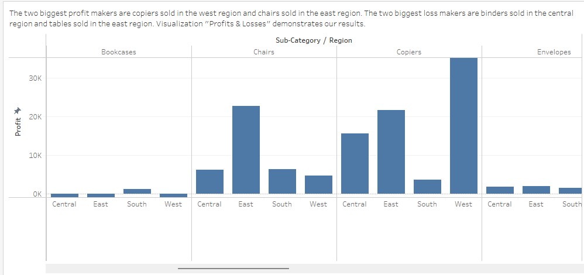
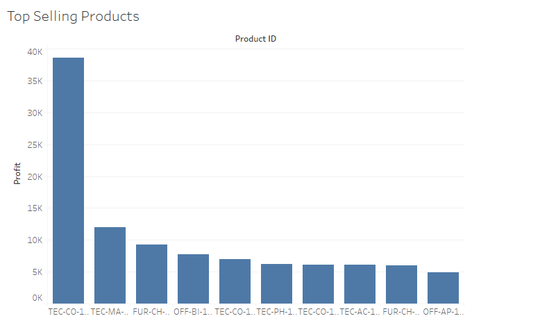
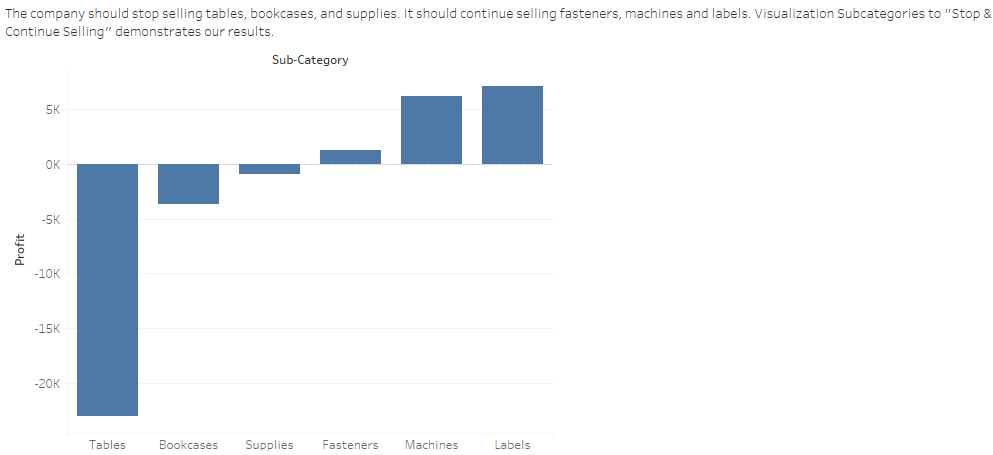
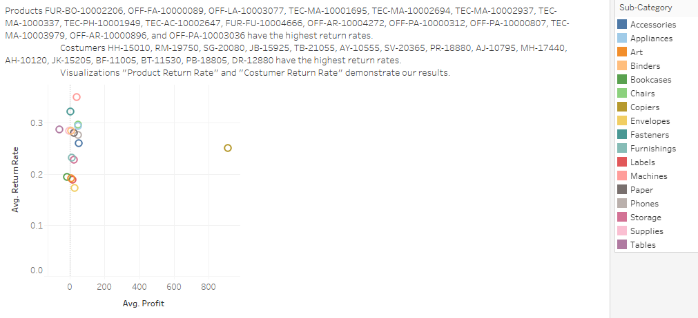
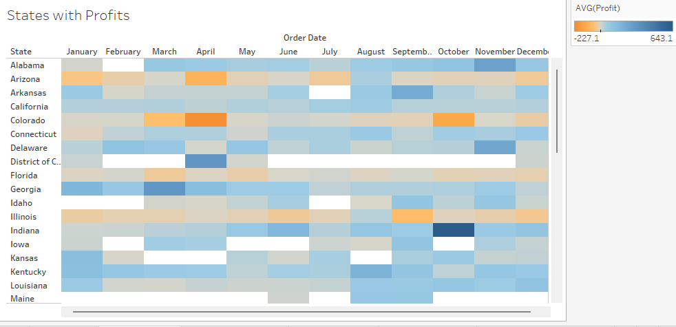

# 📊 Superstore Profitability Analysis

This project analyzes transaction data from a fictional superstore to uncover key business metrics around profitability, customer behavior, and regional trends.

By exploring category-level and regional performance, the goal is to inform data-driven recommendations that help improve operational strategy, optimize product offerings, and focus on geographic areas with high potential for profitability.

📊 [View Full Tableau Dashboard](https://public.tableau.com/views/superstore-profitability-analysis/AverageProfitvsAverageRetunRate)  
📄 [Download Dataset (Excel)](https://practicum-content.s3.us-west-1.amazonaws.com/data-eng/remodeled/dvwt/Superstore.xls?etag=4616d537c163874941cf5fc3c9002fa8)

---

## 📚 Skills & Techniques Applied

This project was completed as part of the **Data Visualization with Tableau** sprint in TripleTen's Business Intelligence Analyst program.

### 📈 Visual Analytics
- Built **bar charts** and **scatter plots** to highlight profitability trends across products and regions  
- Designed **geographic maps** to visualize state-level differences in revenue and seasonal performance  
- Used **highlight tables** to compare return rates and profit margins by category

### 🎯 Dashboard Design Principles
- Emphasized clean visual communication with consistent formatting and color use  
- Structured charts around actionable insights (e.g., products to stop selling, top-performing regions)  
- Focused each visual on a specific business question to maintain clarity and narrative focus

### 🔧 Data Structuring in Tableau
- Used **calculated fields** and filters to derive metrics like return rate and profit average  
- Aggregated sub-categories and states for summary-level insights  
- Applied filters and visual grouping directly in Tableau (no external preprocessing)

---

## 🔍 Objective

To translate raw transaction data into actionable business insights by identifying:

- High-performing products and sub-categories  
- Product lines and regions with consistent losses  
- Customer return trends and their effect on profits  
- Seasonal and regional profit trends across the United States

---

## 📊 Key Visualizations & Insights

### 1. Profits & Losses by Region and Sub-Category  
  
**Insight:**  
Copiers in the West and chairs in the East are strong profit contributors, reflecting regional demand. In contrast, binders in the Central region and tables in the East consistently lose money. These losses highlight inefficiencies in either pricing, product quality, or local demand patterns, and suggest a need to reassess procurement and marketing strategies in these segments.

---

### 2. Top Selling Products by Profit  
  
**Insight:**  
A small number of products contribute disproportionately to overall profit, underscoring the classic 80/20 rule (Pareto Principle). Strategic focus on these high-margin products — through better stock availability, promotions, or cross-selling — can maximize revenue with minimal effort. These products should be prioritized in inventory and marketing planning.

---

### 3. Sub-Categories to Stop & Continue Selling  
  
**Insight:**  
Tables, bookcases, and supplies underperform financially and may no longer justify shelf space. On the other hand, machines, fasteners, and labels show consistently positive returns. This visualization provides a basis for discontinuing low-value sub-categories and reallocating those resources to proven profit centers.

---

### 4. Average Profit vs. Average Return Rate  
  
**Insight:**  
Some products with low or negative profits also have high return rates, indicating dissatisfaction or quality issues. Products in the top-left quadrant (low profit, high returns) are liabilities and should be reviewed for redesign, discontinuation, or vendor reassessment. Low-return, high-profit products represent the sweet spot for future focus.

---

### 5. State-Level Profitability  
  
**Insight:**  
Profitability varies significantly by state and month. States like Indiana (October), Vermont (November), and Washington (March) show strong seasonal performance and could benefit from targeted advertising during their peak months. These trends offer opportunities for regional promotions and demand forecasting.

---

## 🧠 Conclusion

This analysis reveals clear action items for improving profitability across the business:

- **Double down** on products and regions generating strong returns  
- **Cut or investigate** items and locations consistently causing losses  
- **Leverage return data** to improve customer satisfaction and retention  
- **Align marketing and stock strategy** to seasonal and regional trends

By acting on these insights, the superstore can reduce waste, increase margins, and better meet customer needs.

---

## 🛠 Tools Used

- Tableau Public (Data Visualization)  
- GitHub (Project Versioning & Collaboration)

---

🚀 *Final project submission for the Data Visualization with Tableau sprint at TripleTen.*
