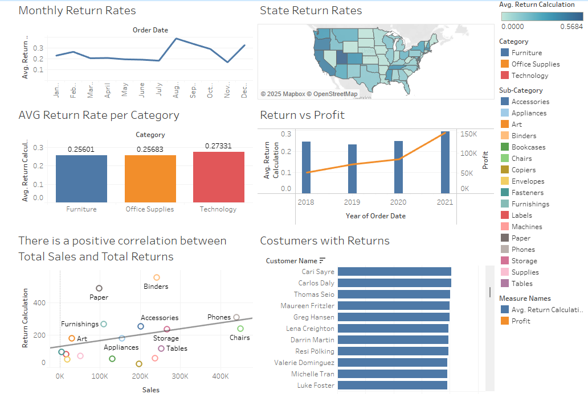
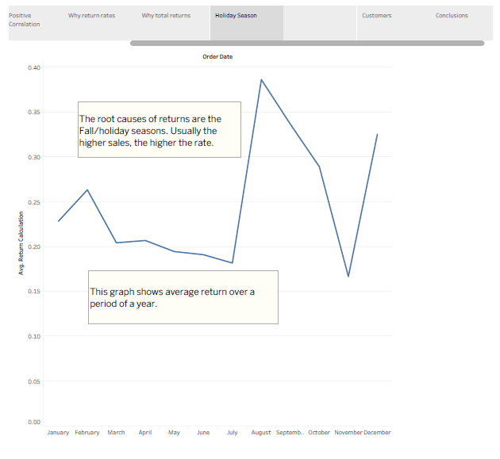
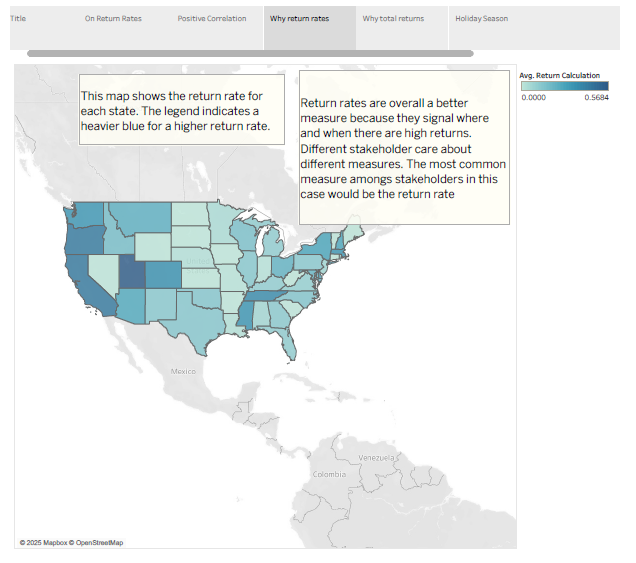
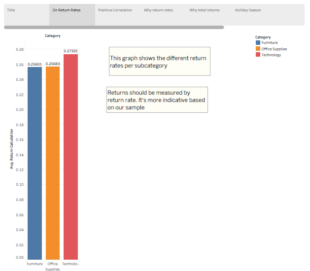
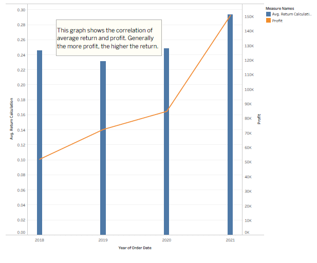
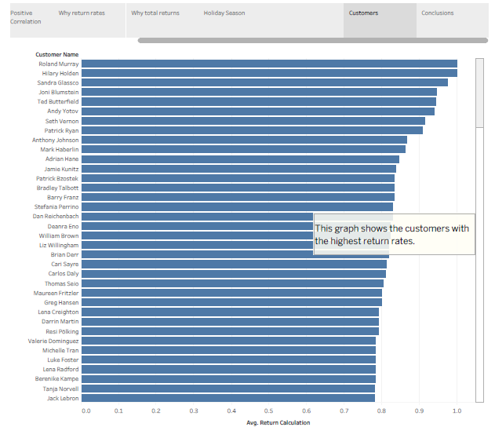

# 📦 Superstore Returns Analysis

## 📌 Project Overview

This project investigates the root causes of high return rates at a fictional Superstore. Using Tableau dashboards and story points, we analyze customer return behavior across products, locations, seasons, and customer segments. The objective is to present strategic insights that help reduce returns and improve profitability across departments and regions.

---

## 🔍 Objective

To help the CEO understand:
- What factors are driving product returns?
- Are there geographic or seasonal trends?
- Which customers or products are most return-prone?
- What actions can the business take based on the data?

By translating raw order and return data into interactive dashboards and compelling narratives, this project guides leadership in prioritizing cost-reduction strategies while maintaining customer satisfaction.

---

## 📈 Final Dashboard & Visualizations

📊 [View the Interactive Tableau Story](https://public.tableau.com/views/superstore_returns_analysis_17488407955700/FinalStory)

### Final Dashboard  

### Monthly Return Rates  
  
**Insight:** Returns increase in fall and winter months, particularly September and December, suggesting seasonal influences on returns.

### State Return Rates  
  
**Insight:** Higher return rates cluster around the West Coast and Northeast, signaling geographic patterns that may be linked to logistics or expectations.

### Return Rate by Category  
  
**Insight:** Technology has the highest average return rate, indicating potential post-purchase dissatisfaction or complexity.

### Return Rate vs. Profit  
  
**Insight:** Profit increased over time despite a stable return rate, hinting at improved efficiency or pricing strategy.

### Sales vs. Returns Correlation  
  
**Insight:** Subcategories like Binders and Accessories show high sales and high returns, while Phones perform well with low returns — ideal for scaling.

### High-Return Customers  
  
**Insight:** A small group of customers drive the highest return rates — possible targets for outreach or review.

---

## ✅ Strategic Recommendations

- **Improve product descriptions and customer support** for high-return categories.
- **Localize return policies** and adjust shipping for high-return regions.
- **Flag and engage with high-return customers** for retention or investigation.
- **Align campaigns with return trends** during peak seasons to minimize regret purchases.

---

## 🛠 Tools Used

- **Tableau Public** – Visual storytelling & dashboards  
- **Excel** – Data preparation & pivot calculations  
- **GitHub** – Version control & documentation

---

🚀 Final project submission for the *Storytelling with Data* capstone in TripleTen's Business Intelligence Analyst program.
